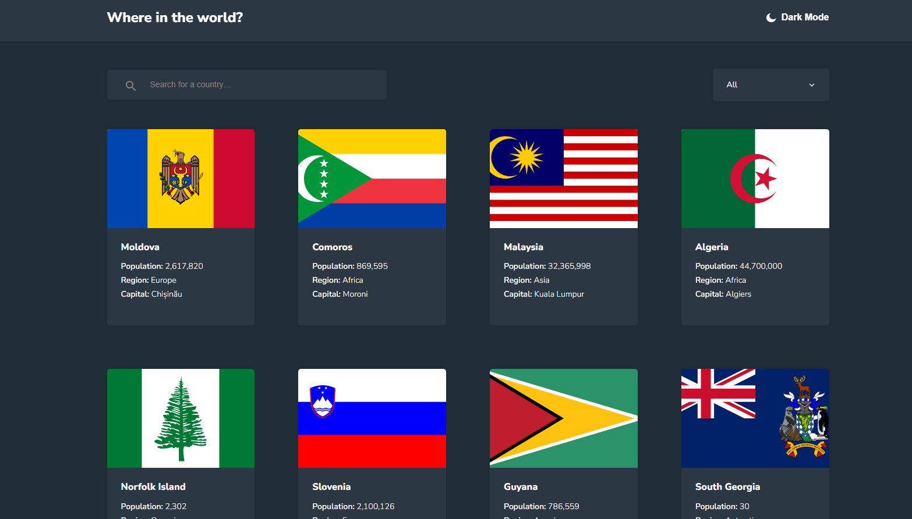

# Rest Countries Explorer

전 세계 국가 데이터를 탐색할 수 있는 **인터랙티브**하고 **반응형** 웹 앱입니다.  
**JavaScript (ES6+)**로 제작되었으며, **Webpack + Babel**로 번들링, **CSS3**로 스타일링되어 깨끗하고 접근성이 뛰어난 모바일 친화적인 경험을 제공합니다.

## 🧠 주요 기능

- 국가 이름으로 검색
- 지역별 국가 필터
- 국가 세부 정보 보기 (국기, 인구, 수도 등)
- 모바일 및 데스크톱 반응형 디자인
- **REST Countries API**에서 데이터 가져오기
- **Webpack**으로 최적화된 번들링

## 📸 미리보기



## 🚀 시작하기

### 사전 준비

- **Node.js**와 **npm**이 설치되어 있어야 합니다.

### 설치

```bash
git clone https://github.com/DevFayzullo/rest-countries-explorer.git
cd rest-countries-explorer
npm install
```

### 개발 모드 실행

```bash
npm run dev
```

### 프로덕션 빌드

```bash
npm run build
```

## 🌐 라이브 데모

👉 [라이브 데모 보기](https://devfayzullo-countries.netlify.app/)

## 🛠️ 기술 스택

- **JavaScript (ES6+)**
- **Webpack + Babel**
- **CSS3** (Flexbox, Grid)
- **REST Countries API**
- **Netlify** (배포)

## 📄 라이선스

이 프로젝트는 **MIT License**로 라이선스가 부여됩니다.

---

📌 개발자: **DevFayzullo**

> “지식은 힘이다. 정보는 해방이다.” – 코피 아난

즐거운 코딩 되세요! 🌍
