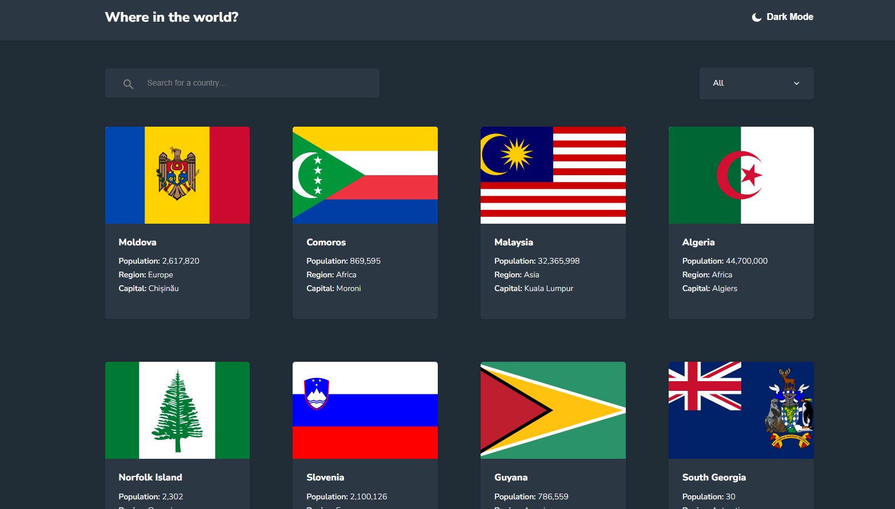

# Rest Countries Explorer

This is a JavaScript web application that displays detailed information about countries using the [REST Countries API](https://restcountries.com/).

## 🌍 Features

- View country information including flag, name, capital, region, and population
- Filter countries by region
- Responsive design
- Built with Webpack and Babel

## 📸 Preview



## 🚀 Getting Started

### Prerequisites

- Node.js and npm installed

### Installation

```bash
git clone https://github.com/your-username/rest-countries-explorer.git
cd rest-countries-explorer
npm install
```

### Run in Development Mode

```bash
npm start
```

### Build for Production

```bash
npm run build
```

## 🌐 Live Demo

👉 [Click here to view the live demo](https://devfayzullo.github.io/rest-countries-explorer/)

## 🛠️ Tech Stack

- JavaScript (ES6+)
- Webpack
- Babel
- HTML & CSS

## 📄 License

This project is licensed under the MIT License.

---

🔧 Developed by **DevFayzullo**

Happy coding! 🚀
